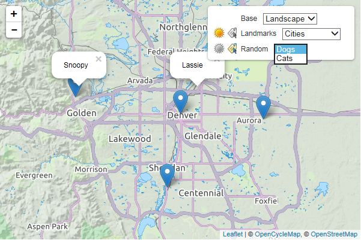

Leaflet.sgsilayercontrol
===========================

This is a replacement for the standard Leaflet layer control.
Unlike the standard control where each row represents a single map layer,
this control allows you to grouped layers together into a select element,
so that only one is active at a time. Only the active layer in a group can be 
displayed. All the others are hidden.

Instead of checkboxes, there is a toggle image (same idea - you click it on or off).
In addition to the display toggle, there is an optional secondary toggle that invokes 
a callback. We use this secondary option to manage label visibility, but it 
is not limited to that purpose. You can use it to adjust the map however you like.



The [example](example/basic.html) shows its usage with various layers.

## Installation

Include the compressed JavaScript and CSS files located in the `/dist` folder.

This project will soon be available via bower:

```
bower install leaflet-sgsilayercontrol
```

## Usage

### Initialization - Groups

Each row in the layer control is initialized by a LayerControlGroup object.
You will need to create an array of these to pass into the layer control.
The LayerControlGroup constructor takes three arguments:

```javascript
  // LayerControlGroup(layers, name, options)
  //
  //  layers: an array of Leaflet layers, or this can also be a single layer object.
  //  name: the name you want to appear for this layer in the control
  //  options: these are used to initialize the toggles -
  //           display: show, hide
  //           labels: hide, checked, unchecked 

  var groups = [
    new LayerControlGroup([streets, landscape, grayscale], "Base", { display: "hide", label: "hide" }),
    new LayerControlGroup([cities, restaurants], "Landmarks", { display: "show", label: "unchecked" }),
    new LayerControlGroup([dogs, cats], "Random", { display: "show", label: "checked", selectedItemName: "Cats" })
  ];

```

The display toggle will be set to checked or unchecked automatically based on the 
state of the map, but the the labels toggle is custom and you will need to set
its initial state explicitly. 

Hint: If you want to create a set of base layers, so that one is always visible,
create the LayerControlGroup with the display option set to "hide". Make sure one
of the layers is added to the map initially. Then a user can change which layer is
visible by selecting a different active layer in the drop down, but they cannot
turn off the active layer. It will always be visible.

### Initialization - Layer Control

Create a layer control object with the groupedLayers contructor. This constructor takes
two arguments, an array of LayerControlGroup objects and a set of options:
  
```javascript
  // L.Control.groupedLayers(groups, options)
  //
  //  autoZIndex: boolean - if true, the layers will be assigned z-index values.
  //  labelCallback: this function called whenever one of the label toggle is clicked
  //    (or if the user changes the selected layer AND the layers toggle is on).

  var layerControl = L.control.groupedLayers(groups, { autoZIndex: true, labelCallback: handleLabels });
  map.addControl(layerControl);
```

Leaflet.sgsilayercontrol is free software, and may be redistributed under
the MIT-LICENSE.
